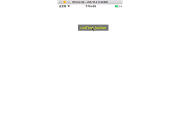

### 一、运行时
所谓运行时，就是说程序在运行(或者在被执行时)的状态，运行时对于项目编程来说是一个必要重要的机制，能够帮我们处理很多未知的情况，比如说动态创建类、添加属性、方法等。

<!-- more -->

### 二、运用领域
* 在程序运行时，动态创建一个类
* 在程序运行时，动态为某类添加属性、方法，修改属性值、方法名称
* 。。。

### 三、这里简单说一下方法交换机制
比如说一个工程里面，你们会使用很多系统控件，比如说UIButton，假设有一个需求说要将所有的button的点击标题颜色改成其他的颜色，难道你要一个一个去修改？估计你会想死的心都有，那怎么办？方法交换机制可以帮到你,

#### 原始代码：
```
    UIButton *runTimeButton = [UIButton buttonWithType:UIButtonTypeCustom];
    [runTimeButton setFrame:CGRectMake(100, 100, 150, 30)];
    [runTimeButton setTitle:@"button" forState:UIControlStateNormal];
    [runTimeButton setTitleColor:[UIColor purpleColor] forState:UIControlStateNormal];
    [runTimeButton setTitleColor:[UIColor blueColor] forState:UIControlStateHighlighted];
    [runTimeButton setBackgroundColor:[UIColor whiteColor]];
    [runTimeButton addTarget:self action:@selector(buttonClicked:) forControlEvents:UIControlEventTouchUpInside];
    [self.view addSubview:runTimeButton];
```

只要新建一个UIButton的分类，实现类似下面的代码就可以实现方法的交换，这样你就可以在不改动原始代码的情况下实现所有按钮的标题颜色
#### 新建分类代码：
```
+ (void)load {
    Method setTitleColorMethod = class_getInstanceMethod(self, @selector(setTitleColor:forState:));
    Method hyc_setTitleColorMethod = class_getInstanceMethod(self, @selector(hyc_setTitleColor:forState:));
    method_exchangeImplementations(setTitleColorMethod, hyc_setTitleColorMethod);
}

- (void)hyc_setTitleColor:(UIColor *)color forState:(UIControlState)state {
    [self hyc_setTitleColor:[UIColor yellowColor] forState:state];
    if (state == UIControlStateHighlighted) {
        [self hyc_setTitleColor:[UIColor redColor] forState:state];
    }
}
```

#### 看看效果：



