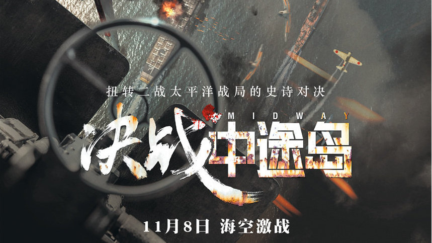
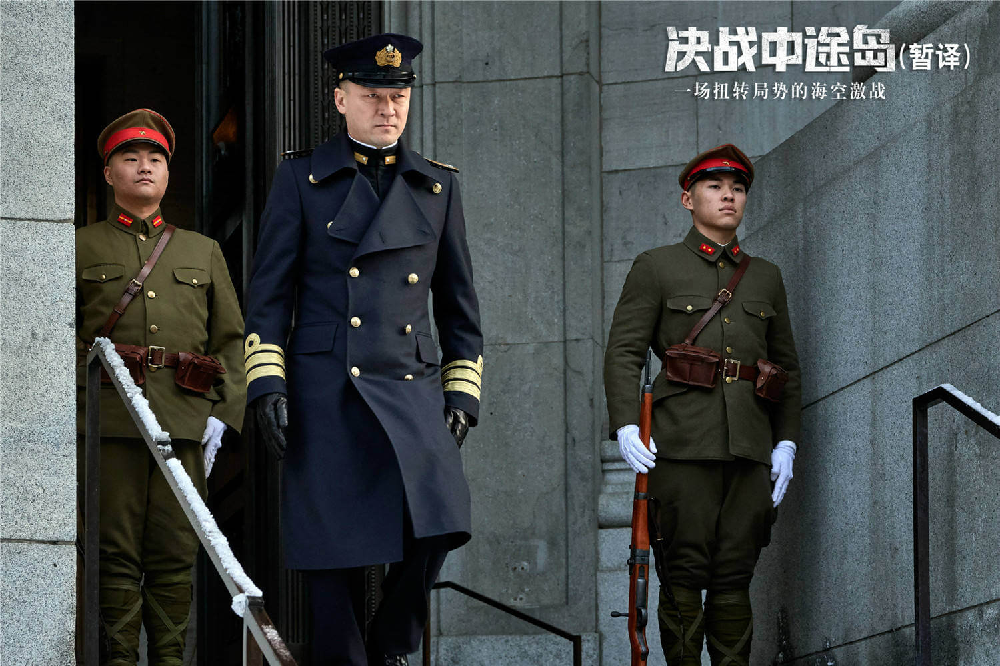
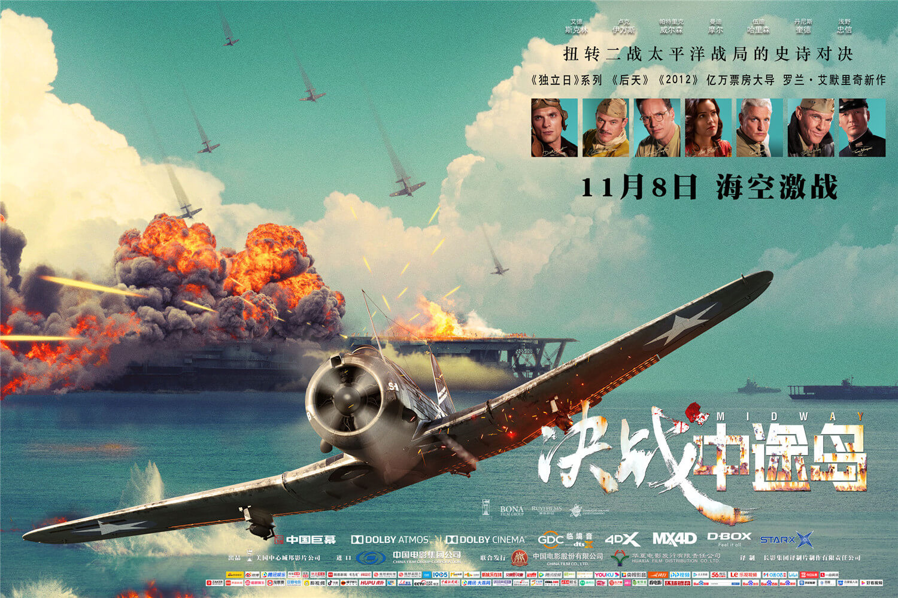
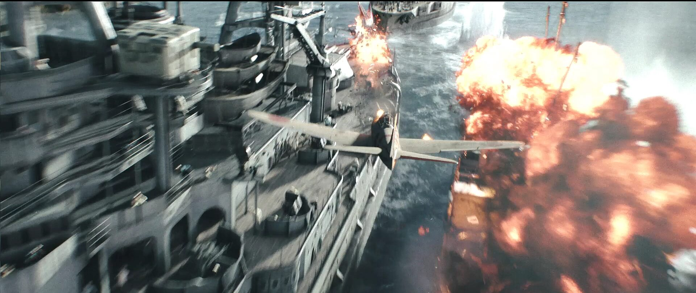
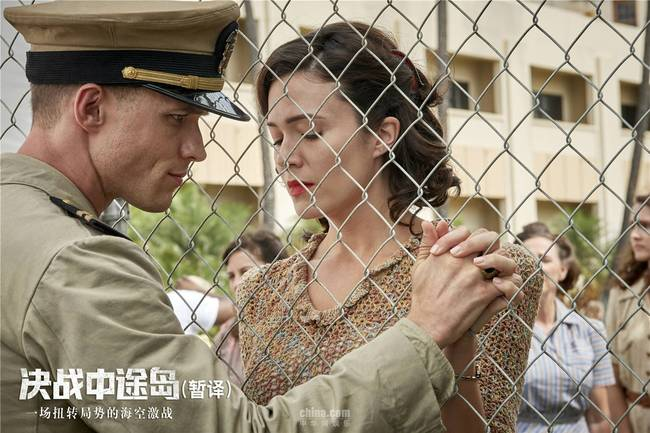
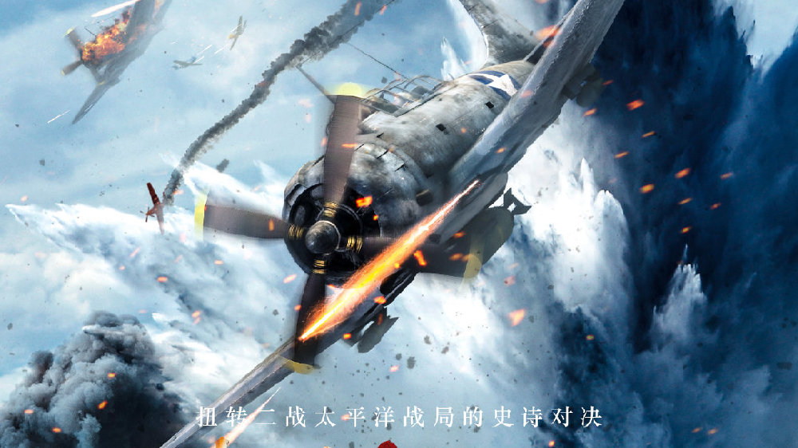

# 《决战中途岛》有感

test

前段时间，抽空去看了部电影 -《决战中途岛》，画面伊始，我看到的是一个美国的情报官员跟日本官员在聊着什么，电影院太嘈杂，没听清说的什么，然后情报官员一脸无奈的走了，转眼间，便是一个非常震撼的场面，日本的战斗飞机在毫无预警的情况下横穿珍珠港的上空，投下穿甲炸弹，机枪子弹四处横飞，并向美军的战列舰和巡洋舰发射鱼雷，美军毫无防备，他们在爆炸的巨响中醒来，仓促进行自卫，然而，始终还是抵挡不住日军突如其来的猛烈攻势，最终，整个珍珠港变成了一片火海，哀鸿遍野，只有广播还在盘旋着：“珍珠港受空袭，这不是演习！...”的警报。

<!-- more -->

电影开端，交代了日本偷袭珍珠港的事件，个人觉得还是很有必要的，偷袭珍珠港事件在美国总统罗斯福认为，是国耻，次日，便发表了著名的“国耻”演讲，随后也签署了对日本帝国的正式宣战声明，因此偷袭珍珠港事件也成为了第二次世界大战，太平洋战争爆发的导火线，中途岛战役是第二次世界大战的重要战役，也是美国海军以少胜多的著名战役，交代珍珠港事件能更好得为美国海军在中途岛战役中为什么在敌众我寡的情况下依然能有取得胜利的决心。

真实，这是我的第一感觉，没有过分的修饰，没有华丽的特效，没有强加的情节；有的只是面对日本偷袭珍珠港后美国海军的义愤填膺，有的只是美军情报组在截获日军情报并解码后还谨慎验证的兴高采烈，有的只是俯冲轰炸机战士那股视死如归决胜千里的锲而不舍。自古以来，战争本来就是一件残酷的事，胜败往往在毫厘之间，如果过分修饰，往往会显得不够真实，战争电影的意义不是原原本本地将历史搬到荧幕上，但如果太过于浮夸，又会显得有点与人性不符，每个人都可以梦想成为当代“马云”“马化腾”这样的风云人物，但毕竟现实生活中不可能，如果人人都是“马云”，那“马云”就是世界上最穷的人，必然会出现另外一个标签来取代。为什么说它真实？电影讲述到主角 迪克·贝斯特 是一个又才华且放荡不羁的人设，电影中有一幕场景是这样的，战斗机在航空母舰中起飞，迪克·贝斯特 的飞机第一个起飞，但是在起飞的瞬间他发现航母的速度尚未达到战斗机起飞的条件，但是他仍然依靠过硬的技术勉强将飞机飞了起来，同时他立马通知了航母以及其他机组成员，但是后面一台飞机已经来不及拉停，最终掉落在了无情的深海当中，这些情节，我想，也不是历史中存在的，我觉得它真实，不是因为它贴近历史，而是因为感觉它融入了生活的细节，确实，在生活中，我们不可能做到事事俱到、万事具备，完全没有错漏，更别说在战争这么紧张的气氛中了。

贴近历史，这是我的第二感觉，虽然我没有专门研究过近代的战争历史，但在观影后我特意回来查了一下近代战争中关于太平洋的多个战役资料，“AF”关键字破译、淡水缺乏的谎言、美军轰炸东京、 山本五十六 “唤醒沉睡的巨人”的话语、 南云忠一 的优柔寡断，鱼雷换炸弹，炸弹换鱼雷的事都在相关资料中有所提及，我不是一名史学研究者，无法在这些事件中探索真伪，我只能凭借自己的感觉，然后根据一些史学资料的辅助来判断，片中讲述到日本发起“中途岛之战”之前抛出了个烟幕弹，让美军推敲出日本可能攻击的地方有两个，一个在南，一个在北，两者相距数千海里，选错，可能造成不可挽回的后果，但是莱顿情报官手下却恰好有个不修边幅但能力超强的情报分析员， 切斯特·尼米兹 也是一个非常大胆的司令官，采用了这个情报分析员的结果，不然也不会出现后面的 尼米兹 司令官对 莱顿 中校说：“祝贺你，与你预报的只差了5海里...”的说法。

感情丰富，这是我的第三感觉，同窗之谊，故事开端，即交代了珍珠港被偷袭的时候 迪克·贝斯特 在海军学院的同学选择战斗到最后一刻，为了确认同窗的下落，他赶到现场，到处询问，当战地医生揭开了那块白布，他的第一反应是不相信，我记得应该是医生问他因为死者太多了，无法一一确认身份，问他有没有其他特征时，他死死地盯着那具尸体，最终吐出了：“我们一起在海军学院学习，他应该手上还戴着海军学院的毕业戒指”。医生最终拿出了那份戒指，是的，哪怕没有拿出戒指，他也认出了那是他的好兄弟，那一刻，在残酷的战争映衬下，兄弟情谊显得额外深沉、格外厚重，也衬托的他后面的复仇之心。爱家情愫，在战役爆发的前夜，他回到了家，亲吻着熟睡的女儿入了神，入睡前，这位铁骨铮铮的男儿，更是拥着妻子难以入眠，沉默与叹息包裹着他对家人深深的爱和对家庭的眷恋不舍，不得不说，这点刻画，展现了一个男人内心最柔软的一面。钢铁意志，在进行“突袭东京”前， 杜立特 所带领的轰炸机部队中所有人都知道这是一个无法返航的轰炸行动，由于轰炸机所携带的燃油不够用，轰炸结束后他们无法返航，只能继续飞行前往中国的台州、丽水等地，跳伞后还很有可能落入日占区。无疑，这是一个九死一生的行动。出发前一刻，杜立特最后一遍问战士们：“有没有想退出的？”，得到的回答是：“长官，我们都要去！”。为珍珠港复仇的决心、为国赴死的决然，是每一个热血男儿的底色，影片将此表现得淋漓尽致。在表现钢铁意志一面的同时，影片没有忽略关于男性个人成长的戏份，影片中的 默里 就担当起了这个重任，作为 迪克·贝斯特 上尉的助手，他刚开始非常惧怕战火纷飞的场面，甚至一度想要退出战争，收拾包裹想要回家，但是上尉的一番话开导了他，“如果你知道你身上肩负着多少希望，你就能面对任何事，你余生都会记住这个时刻”，牢记住这句话的 默里 学会了坚强和担当，并在战场上勇敢地使用机关枪向敌人扫射，哪怕最后因为战机在空中摇曳导致机关枪无法抓紧而烫伤了手也强忍着疼痛继续战斗，这份成长的经历，是处于和平时代的我们无法承受的。

看完了这部电影我就想着写一篇观后感，看到网上的评价流言蜚语、吐沫横飞，甚少看战争题材影片的我，更加坚定了想要写这篇文章的欲望，是，在影片中还有很多细节可以诟病，但，我觉得这仍不失为一部好电影，从题材上、感情布线上、战争情节上都有条不紊，井然有序，环环相扣，虽然看得过程中也不是所有的环节都能看懂，但是相对某些国际大片来说，理解还是不算难的了。
