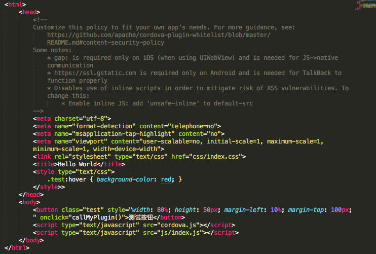

## 准备工作
1. 安装 [node.js](http://nodejs.cn/) 主要使用了node.js 的包管理工具npm，这个笔者就不详细介绍了，相信作为一个开发者，不管前后端对这个东西都不会说完全不认识。

<!-- more -->

npm 安装完成了以后可以执行 `npm -v` 验证下是否安装成功


2. 安装 plugman (全局安装)

> npm install -g plugman

一般安装完成会出现这样的界面:


安装完可以执行 `plugman -v` 验证下是否安装成功
如安装成功: 


##### 到这一步基本准备工作已完成，下面就可以开始开发你的插件了。

## 创建插件
### 1. cd <到你需要存放插件的地方>

 为了方便找到和演示，我直接在桌面创建了一个MyPlugins的文件夹, 这一步可以省略，至于为什么，请看第二步就明白了。
 
 
 
 ### 2. 执行一下命令创建插件
 
 以 `MyPlugin` 为例
```
plugman create --name <pluginName> --plugin_id <pluginID> --plugin_version <version> [--path <directory>] [--variableNAME=VALUE]
```

```
参数:
pluginName: 插件名字
pluginID: 插件id, egg : coolPlugin 
oversion: 版本, egg : 0.0.1
directory:一个绝对或相对路径的目录，该目录将创建插件项目
variable NAME=VALUE: 额外的描述，如作者信息和相关描述

egg : plugman create --name MyPlugin --plugin_id com.charls.MyPlugin --plugin_version 0.0.1 
```

创建成功以后MyPlugins文件夹下会出现一个MyPlugin的文件夹:


文件结构目录如下:


### 3. 为插件添加支持平台
- cd 到你的插件根目录
- 执行一下命令:

```
plugman platform add --platform_name <platform>
egg : plugman platform add --platform_name ios
```

你会发现这个时候插件的目录发生了变化:


- .m 文件当然就是你实现功能的原生代码
- .js 文件就是开放给前端js调用的接口代码

### 4. 编写你的插件实现功能

打开 MyPlugin.m 文件，编写一下代码；

或者根据你的喜欢写自己的功能，因为单个文件不好编辑，所以你也可以先在一个demo中编辑功能代码并测试功能是否有效。

不过对js开发的类一定要继承`CDVPlugin`

```
/********* MyPlugin.m Cordova Plugin Implementation *******/

#import <Cordova/CDV.h>

@interface MyPlugin : CDVPlugin {
  // Member variables go here.
}

- (void)coolMethod:(CDVInvokedUrlCommand*)command;
@end

@implementation MyPlugin

- (void)coolMethod:(CDVInvokedUrlCommand*)command
{

    [self showAlert];

    CDVPluginResult* pluginResult = nil;
    NSString* echo = [command.arguments objectAtIndex:0];

    if (echo != nil && [echo length] > 0) {
        pluginResult = [CDVPluginResult resultWithStatus:CDVCommandStatus_OK messageAsString:echo];
    } else {
        pluginResult = [CDVPluginResult resultWithStatus:CDVCommandStatus_ERROR];
    }

    [self.commandDelegate sendPluginResult:pluginResult callbackId:command.callbackId];
}

- (void)showAlert {
    UIAlertController *alert = [UIAlertController alertControllerWithTitle:@"提示" message:@"恭喜你，调用插件成功了!" preferredStyle:UIAlertControllerStyleAlert];
    UIAlertAction *cancelAction = [UIAlertAction actionWithTitle:@"取消" style:UIAlertActionStyleCancel handler:nil];
    UIAlertAction *sureAction = [UIAlertAction actionWithTitle:@"确定" style:UIAlertActionStyleDefault handler:nil];
    [alert addAction:cancelAction];
    [alert addAction:sureAction];
    [self.viewController presentViewController:alert animated:YES completion:nil];
}

@end
```

### 5. 创建package.json文件

```
plugman createpackagejson <directory>
egg: plugman createpackagejson 
```

然后需要你根据提示填写相关的内容，最后生成一个这个插件的描述信息文件。

如图: 最后，输入`yes`就行了


### 6. 注意项
---
基本到了这一步，一个简单的插件已经创建完了, 下面就是验证工作了。

不过，还有些地方应该注意的。


- `clobbers` 中的 `target` 限制了你如何调用插件
- `config-file` 中的内容会被配置到工程的`config.xml`中
- `source-file` 指定了插件的路径


## 使用插件

新建或打开一个cordova项目,然后执行:


```
cordova plugin add <你的插件(名称\路径\git地址)>
egg: cordova plugin add /Users/charls/Desktop/MyPlugins/MyPlugin
```

新增iOS平台

```
cordova platform add ios --save
```


如果不出意外的话:


再看看工程中的plugins目录是否存在这个插件


修改index.html 和 index.js




然后执行:
cordova run ios

最后运行效果:


[Demo地址](https://github.com/CharlsPrince/MyPluginsDemo)

