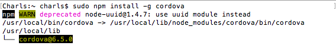

### 1、使用node.js的依赖包管理工具npm进行Cordova的安装
打开终端输入如下命令：
~~~
sudo npm install -g cordova  // 尽量不要使用sudo
~~~
题外话，有安装就有卸载：
~~~
sudo npm uninstall cordova -g
~~~

<!-- more -->

### 2、创建Cordova的项目
<h6>2、1 新建一个Cordova的项目</h6>
~~~
cordova create hello com.example.hello HelloWorld [--template templatePath]
~~~
~~~
cordova create ccc com.example.ccc CCC
~~~

Parameter | Description | Notes
--------- | -------------- | ----------
hello `参数是必填`  |   将为你的项目生成一个hello目录 | www子目录是应用程序的主页，以及各种资源(css,js,img)，遵循共同的web开发文件命名规范。这些资源将存储在设备上的本地文件系统，而不是远程服务。config.xml文件包含重要的需要生成和分发应用程序的元数据。
com.example.hello `参数可选` | App ID | 如果不填写这个参数，第三个参数就要省略，默认值是 io.cordova.hellocordova，但建议你填写一个适当的值。
HelloWorld`参数可选` |	应用程序的项目名|	这个参数的默认值是 HelloCordova，但建议你填写一个适当的值。
[--template templatePath] `参数可选，一般不填写` |	使用模板创建一个项目。|	所有文件和文件夹的模板将被复制到新的项目。平台和插件可能包含在一个模板。这个参数是可选的。模板的路径可以是一个本地路径，NPM模块或Git URL。

######  2、2 添加平台
所有后续命令需要在项目的目录中运行，其范围内或任何子目录：
~~~
cd Desktop/ccc
~~~
在创建项目之前，您需要指定一组目标平台：
~~~
cordova platform add ios
~~~
*  迭代项目 在ccc目录中运行下面的命令来构建项目：
~~~
cordova build
~~~
*  或指定生成iOS平台的代码项目：
~~~
cordova platform add ios
~~~

### 3、cordova项目
###### 3、1 cordova项目创建完成

###### 3、2 Events Cordova声明周期事件
  *  deviceready 当Cordova加载完成会触发
将index.html中的文本替换成如下文本：
~~~
<!DOCTYPE html>
<html>
<head>
<title>Device Ready Example</title>

</head>
<body onload="onLoad()">
</body>
</html>
~~~
运行结果：

  * pause 当应用程序进入到后台会触发
  * resumes 应用程序从后台进入到前台会触发
》》》步骤：替换html文本 -> 运行iOS程序 -> 开发者调试 -> 模拟器进入后台再进入前台
将index.html中的文本替换成如下文本：
~~~
<!DOCTYPE html>
<html>
<head>
<title>Pause Example</title>

</head>
<body onload="onLoad()">
</body>
</html>
~~~

######3、3[Plugin APIs](http://cordova.apache.org/docs/en/deprecated.html)

[cordova-plugin-console](https://www.npmjs.com/package/cordova-plugin-console) Cordova Console Plugin
1> 安装
~~~
cordova plugin add cordova-plugin-console
~~~

![console插件安装
![Uploading 屏幕快照 2017-02-18 上午1.35.13_535134.png . . .]](使用Cordova进行iOS开发/2925367-3e5755e6bdeeab5c.png)
2> 实例
将index.html中的文本替换成如下文本：
~~~
<!DOCTYPE html>
<html>
<head>
  <title>Hello World</title>
  
  
  
</head>
<body>
  
  
       <button onclick="consoleLog()">consoleLog</button> 
       <button onclick="consoleError()">consoleError</button> 
       <button onclick="consoleException()">consoleException</button> 
       <button onclick="consoleWarn()">consoleWarn</button> 
       <button onclick="consoleInfo()">consoleInfo</button> 
        <button onclick="consoleDebug()">consoleDebug</button> 
       <button onclick="consoleAssert()">consoleAssert</button> 
        <button onclick="consoleDir()">consoleDir</button> 
        <button onclick="consoleDirxml()">consoleDirxml</button> 
       <button onclick="consoleTime()">consoleTime</button> 
       <button onclick="consoleTimeEnd()">consoleTimeEnd</button> 
       <button onclick="consoleTable()">consoleTable</button> 
  

  

</body>
</html>
~~~
运行结果：

感谢：[使用Cordova进行iOS开发](http://www.jianshu.com/p/d24219c008b6)

