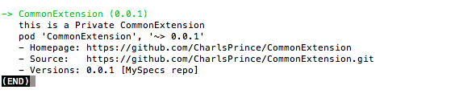

相信每个Developer都会在使用Cocoapods这儿第三方库管理工具，虽然有时候pod install的时候会有种想死的感觉o(╯□╰)o，但依然无法阻挡某些程序员去使用它的热情，why？因为它能使你的项目工程看起来更加简洁，更加有条理性，而不至于使自己项目的Vendor文件夹看起来臃肿，而且能减少手动导入静态framework的麻烦，也可以将自己封装好的代码提交到Trunk供自己和别人使用，的确方便。

 <!-- more -->

但有时候我们将代码封装起来后，想要重复利用，又不想push到Trunk(毕竟在又要验证又要被墙什么的，麻烦)，这时就需要使用到私有库了，作为小白和英语四级都没过的“程序猿”，在Cocoapods上的确踩了不少的坑，而且Cocoapods官网上面的流程看起来比较官方，只把一些主要的步骤标记出来，根本就没有一个完成的流程，而且全英文，看起来有点吃力(毕竟我是中国人O(∩_∩)O~)

那么我们就不扯远了，什么是私有库？

## 私有库及公有库理解
 > 在我看来，私有库就是自己封装的Code放到不开源的代码仓库，而GitHub就是一个管理开源Code的代码仓库，相信很多同学都是通过在GitHub上开源自己封装好的组件的，毕竟有好东西要学会分享✧(≖ ◡ ≖✿)嘿嘿

## Cocoapods的原理及目录结构

 > Cocoapods一共分成两块，就是[Cocoapods](https://github.com/CocoaPods/CocoaPods)和[Specs](https://github.com/CocoaPods/Specs),Specs是一个目录容器，将所有的第三方的podspec存放在这里，而podspec就相当于是这个库的介绍文件，里面包含了库的名字、版本、下载地址等信息
 
### 注意项
* ~/.cocoapods/repos/master

> 开源第三方库管理podspec的地方，这个文件夹是在使用Cocoapods的时候自动从[Specs](https://github.com/CocoaPods/Specs)上clone到本地的
> 基本目录结构：
> repos->master->Specs->[Name]->[Version]->[Name].podspec

这个就是共有的第三方的目录，我们要做私有库，可以模仿共有库的目录结构，建立一个自己的Spec私有仓库来维护，以后我们要维护的东西基本就两样：

```
1. 私有的Specs目录
2. 我们要上传的库
```

## 步骤

### 一、创建私有的Specs目录
在远端(GitHub\其他代码管理服务器，因为我使用的是GitHub，所以下文说到的远端都是指GitHub)建一个仓库，命名为MySpecs,将仓库clone到本地(可以是桌面或指定文件夹下)，将共有的Cocoapods-version.yml文件拷贝到里面，并创建一个命名为“Specs”的文件夹(在文件夹里面随意的文件，只要不是空文件夹就行了，因为如果是空文件夹的话在push到远端的时候会被忽略)，然后推送到远端，就这样，远端的Specs仓库已经创建完成了，这时本地和远端都会有了两个同步的库，如图：


### 二、将远端的私有Specs仓库clone到本地.cocoapods目录下

在终端运行：
>  $ pod repo add MySpecs https://github.com/CharlsPrince/MySpecs.git 

MySpecs 指的是仓库的名字，后面的路径就是仓库在远端的路径，这个是根据每个人远端仓库的路径而定的，将路径改成你的远端路径就行了

### 三、创建一个podspec文件
cd到工程文件目录下 ，在终端执行命令：
> $ pod spec create CommonExtension https://github.com/CharlsPrince/CommonExtension.git

CommonExtension 指的是这个podspec文件的名字，后面的路径就是这个工程在远端的路径，当然，如果要实现这一步，你需要先将你的工程push到远端，至于怎么push，这里就不详细介绍了，因为如果你使用不同的代码管理服务器方法也不尽相同，执行完了以后你会发现在当前的这个工程文件目录下回出现一个叫CommonExtension.podspec的文件


用sublime打开这个文件，没有sublime的也可以使用系统自带的文本编辑器打开，只不过用sublime打开可以将编辑语言改成Ruby，这样这些文本就会高亮显示了，编辑podspec里面的信息：

```
s.name = "xxxx" #库的名字
s.version = "0.0.1" #版本号，当私有库需要更新的时候只要修改这个值，自行维护
s.summay = "xxxxxx" #库的简介，pod search 显示在上面的介绍
s.description = "xxxxxxxx" #库的详细描述
s.homepage = "https://xxxx" #主页地址，pod search 会显示，一般填写仓库的地址就行了
s.license = "MIT" #开源协议，项目文件目录下需要有一个MIT开源协议文件
s.author = { "name" => "xxxxxx@qq.com" } #作者名字、邮箱
s.platform = :ios, "7.0" #库最低支持的系统版本
s.source = { :git => "https://github.com/CharlsPrince/CommonExtension.git", :tag => "#{s.version}" } #资源地址，pod install 的时候会根据这个地址去下载你的想要库，以及下载的版本，必须要跟s.version一致。
s.source_files = "xxxx" #这个很重要，指定资源文件，前缀就是.podspec文件当前路径，只用写之后的路径，如Class/*是指Class文件夹下的所有文件，但不包括子文件夹里面的文件、Class/**/*是指包含所有Class文件夹下的文件，包括子文件、Class/**/*.{h,m}是指包含所有Class文件夹下的后缀为.h或.m的文件，当然也可以指定文件。
s.requires_arc = true #是否支持arc
>>>>>以下是可选描述<<<<<
#s.resource  = "icon.png" #资源文件，包括图片和xib文件
# s.dependency "JSONKit", "~> 1.4" #需要依赖的三方库
#s.framework  = "SomeFramework" #需要依赖的框架
#s.public_header_files = '' #公开的头文件，如果不没公开，用户在用的时候可能引不到响应的头文件
s.subspec 'subFolder' do |ss|
    ss.source_files = 'Class/xxx/**/*.{h,m}'
    ss.public_header_files = "Class/xxx/**/*.{h}"
end   #这个是子依赖库，因为如果我们只是用s.source_files来指定文件，那么用户在pod下来之后所有的文件都在同一个目录下，没有子文件夹，如果想要分下类，用s.subspec，每一个subspec可以分一个子文件夹，但是记得一定要将.h文件通过ss.public_header_files公开，不然有可能会找不到头文件。
```
当然还有一些其他的，详细介绍可以去Cocoapods看看或可以看看AFNetworking的podspec，他们写得很正规和简洁。

### 四、验证podspec合法性
如果终端是在项目的当前目录下就直接执行一下命令，否则你需要cd到你要验证的.podspec的文件目录下：
> $ pod lib lint 

或

> $ pod spec lint

#### 注意项
* pod lib lint 所编译的源代码是来自于podspec所在目录而不是source所指定git地址
* pod spec lint 会联网校验，通过source中的git地址获取源代码，同时还会校验git地址上是否有对应version字段的tag
* 执行完，如果有错就根据错误修改podspec文件，通过则继续
* 基本通过的话你就直接可以使用这个库了,可以创建一个工程试验一下，在这个新建个工程里面新建一个Podfile文件并输入

```
pod '[Name]', :podspec => '/Users/xxxx/Desktop/xxx/xxx.podspec'

注：[Name]为pod spec中的s.name，必须一致，后面的路径为本地pod spec文件的路径。
```
* 然后cd到这个Podfile的目录下执行
```
pod install
或
pod install --no-repo-update
```
第二条命令是不更新官方Specs至本地，速度要比第一条快，没有必要每次都更新官方的Specs，这会使人崩溃。
不出意外的话打开你这个工程，你会发现工程已经引入这个库了

### 五、向Specs远端提交.podspec文件
cd到你的.podspec文件目录下
验证通过后，给当前代码打上tag，建议tag和版本号一致，并push到远端(官网的tag是不能向下修改的),这时候打开你的远端，你会发现出现了你提交的tag
> $ git tag "0.0.1"
>$ git push origin --tags


将tag推送到远端以后，向自己的私有库提交podspec文件：

> $ pod repo push MySpecs [name].podspec

如果提交成功，去`~/.cocoapods/repos/MySpecs`文件夹下就能找到你创建的私有库了，当然，只是podspec文件哦，因为`~/.cocoapods/repos/`只是用来保存podspec文件的嘛

#### 到这，你的私有库就已经创建完成了

#### 问题小结
1、执行pod lib create （组件库） 出错

```
提示错误：rubygems/core_ext/kernel_require.rb:120:in `require': cannot load such file -- colored2  
         (LoadError)

 解决办法：
     输入上面提示的colored2的两条gem命令即可解决问题
   sudo gem install colored2
   sudo gem update --system
```
2、添加组件库到私有spec repo仓库后 执行 pod search搜索不到。

```
方法一：
        先确认你本地仓库上面确实有你新创建的组件库，这时候可以先删除search缓存文件
    rm ~/Library/Caches/CocoaPods/search_index.json
    ,删除后从新执行pod search ***

    方法二：
    1.切换到某个项目（含有podfile文件）下
    2.执行pod update（提示不能更新）
    3.尝试 pod repo update —verbose获取详细信息，我记得是提示我删除一个 index.lock文件，
4.删除后从新 执行  pod repo update —verbose  会更新本地私有库和master仓库
5.执行pod search ***   创建search索引，可以搜到
```
3、提交本地podspec到Specs仓库的时候出错，提示repo 文件夹下的spec repo is not clean

```
方法一: cd到spec repo 文件夹下，执行 git  clean -f
方法二：cd到spec repo 文件夹下，执行  git  stash
方法三: 删除spec repo 下的Specs仓库，我这里的是“MySpecs”,然后重新从git上将私有仓库clone下来：
pod repo add MySpecs https://github.com/CharlsPrince/MySpecs.git
```


## 注意:
- 每次提交本地podspec到Specs仓库都要将Specs提交到git远程服务器，确保本地仓库与远程仓库同步


### 六、查询私有库并使用
不出意外，这个时候，你去终端pod search 你的三方库名字，就能搜到（如果你的名字和官方Specs里面的某个三方库名字一样的话将会搜不到），使用的时候在Podfile中加入两个Specs源即：
官方源：

> source 'https://github.com/CocoaPods/Specs.git'

私有源：
> source 'https://github.com/CharlsPrince/CommonExtension.git'  #即你的私有源仓库地址

当然，你也可以指定地址
> pod 'xxxx', :git =>'https://github.com/CharlsPrince/CommonExtension.git'

或

> pod 'xxx', :podspec => 'xxxx.podspec'



看到这个界面是不是有点小激动？之前弄的时候踩了不少坑，希望大家不要像我一样踩坑了！！！花了差不多一个下午时间才整理出来，希望能帮到同学们，谢谢，喜欢的点个👍。


