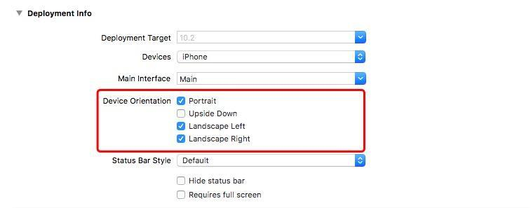

### 直接控制App屏幕旋转方向：
---------

我们可以直接在General -> Deployment info 里面设置限制app旋转方向，这样子就可以控制允许屏幕旋转哪几种方向了，但这个设置并不能实现所有项目的需求，比如做一下视频相关的app，其他的视图都是不允许横屏的，只有视频那个控制器能够横屏，这个时候你根本可能就没有办法再更改设置里面的内容了，只能通过代码去实现横屏。

<!-- more -->

### 代码实现控制屏幕旋转
iOS6.0 以后就是通过以下三个方法实现横竖屏的控制，在`ViewController`里面重写三个方法或创建一个该类的类目实现下面三个方法就能实现了：
~~~
-(BOOL)shouldAutorotate{
    return NO;
}
- (UIInterfaceOrientationMask)supportedInterfaceOrientations
{
    return UIInterfaceOrientationMaskPortrait;
}
-(UIInterfaceOrientation)preferredInterfaceOrientationForPresentation{
    return UIInterfaceOrientationPortrait;
}
~~~
### 但是
  如果你发现你的`ViewController`里面的 `shouldAutorotate` 然而并没有执行的时候，不用疑惑它为什么不执行，仔细想一下，它是`UIViewController`里面的方法，它不执行说明了什么情况呢？没错，就是被别的`UIViewController`截取了，而方法被截取说明了你这个视图控制器不是单一的`UIViewController`，它很有可能是被别的继承于`UIViewController`的类控制了或者说作为了子视图控制器，这个时候你可以检查一下，你的`ViewController`是不是作为了`UINavigationController`的`RootViewController`或者被作为了`UITabBarController`的子控制器，如果是这样的话，只需要在你项目里面的`UINavigationController`或`UITabBarController`添加同样的三个方法就行了

>`UINavigationController`基类添加方法：

~~~
-(BOOL)shouldAutorotate{
    return self.topViewController.shouldAutorotate;
}
/**以下两个方法可不写*/
- (UIInterfaceOrientationMask)supportedInterfaceOrientations
{
    return UIInterfaceOrientationMaskAll;
}
-(UIInterfaceOrientation)preferredInterfaceOrientationForPresentation{
    returnUIInterfaceOrientationLandscapeRight;
}
~~~

>`UITabBarController`基类添加方法：

~~~
- (BOOL)shouldAutorotate{
    return self.selectedViewController.shouldAutorotate;
}
/**以下两个方法可不写*/
- (UIInterfaceOrientationMask)supportedInterfaceOrientations
{
    return UIInterfaceOrientationMaskAll;
}
-(UIInterfaceOrientation)preferredInterfaceOrientationForPresentation{
    return UIInterfaceOrientationLandscapeRight;
}
~~~

