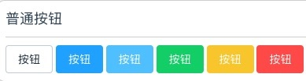
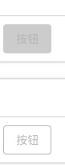
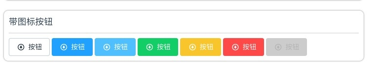
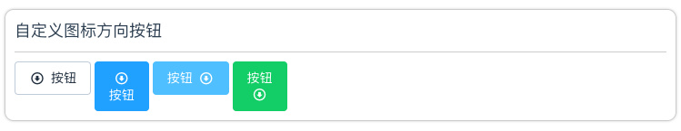

## Button 按钮

常用的操作按钮。

### 基础用法

<!-- more -->

基础的按钮用法。



```
<sgs-button @click="buttonClickedBack()" type="default"></sgs-button>
<sgs-button @click="buttonClicked()" type="primary"></sgs-button>
<sgs-button @click="buttonClicked()" type="info"></sgs-button>
<sgs-button @click="buttonClicked()" type="success"></sgs-button>
<sgs-button @click="buttonClicked()" type="warning"></sgs-button>
<sgs-button @click="buttonClicked()" type="danger"></sgs-button>

```

### 禁用状态

按钮禁用状态



```
<sgs-button @click="buttonClicked()" type="danger" disabled></sgs-button>
<sgs-button @click="buttonClicked()" plain type="danger" disabled></sgs-button>
```

### 带图标的按钮

让按钮不仅是文字



```
<sgs-button @click="buttonClicked()" icon="arrow-with-circle-down" iconPosition="left" type="default"  ></sgs-button>
<sgs-button @click="buttonClicked()" icon="arrow-with-circle-down" iconPosition="left" type="primary"  ></sgs-button>
<sgs-button @click="buttonClicked()" icon="arrow-with-circle-down" iconPosition="left" type="info"  ></sgs-button>
<sgs-button @click="buttonClicked()" icon="arrow-with-circle-down" iconPosition="left" type="success"  ></sgs-button>
<sgs-button @click="buttonClicked()" icon="arrow-with-circle-down" iconPosition="left" type="warning"  ></sgs-button>
<sgs-button @click="buttonClicked()" icon="arrow-with-circle-down" iconPosition="left" type="danger"  ></sgs-button>
<sgs-button @click="buttonClicked()" icon="arrow-with-circle-down" iconPosition="left" 
```

### 设置按钮方向

移动端的按钮图标的方向通常都是不定的



```
<sgs-button @click="buttonClicked()" icon="arrow-with-circle-down" iconPosition="left" type="default"  ></sgs-button>
<sgs-button @click="buttonClicked()" icon="arrow-with-circle-down" iconPosition="top" type="primary"  ></sgs-button>
<sgs-button @click="buttonClicked()" icon="arrow-with-circle-down" iconPosition="right" type="info"  ></sgs-button>
<sgs-button @click="buttonClicked()" icon="arrow-with-circle-down" iconPosition="bottom" 
```


### Attributes

参数 | 说明 | 类型 | 可选值 | 默认值
---|---|---|---|---
type | 类型 | string | primary & info & success & warning & danger & default  | default
icon | 图标，已有的图标库中的图标名 | string | - | -
iconPosition | 图标方向 | string | left & right & top & bottom | left
plain | 是否朴素按钮 | Boolean | - | false
disabled | 是否禁用状态 | Boolean | - | false

### 使用姿势

#### 全局使用

在main.js中添加一下代码:

```
import SGSButton from './packages/buttons/button'
Vue.use(SGSButton)
```


#### 局部使用

在需要使用的组件里引入并注册:

```
import SgsButton from '../packages/buttons/button'
	export default {
		components: {
			SgsButton
		},
```

[源码请拽我](https://git.oschina.net/charls/vue-southgis-components.git)


