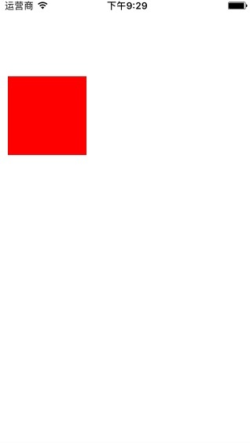

链式编程不得不先说下Masonry，之前的项目使用到自动布局，所以引用了Masonry这个库，感觉写这个库的写得特别好，能够将非常繁琐的布局代码使用一句代码实现：

```
make.right.equalTo(self.view.mas_right).with.offset(-15);
```
像这种通过“点”语法，将需要执行的代码块持续执行，这就是链式编程，他能将代码简单块，使代码通俗易懂，书写方便
像这样`equalTo(self.view.mas_right)`通过“()”去调用函数，一般调用完返回的还是这个对象本身，就是函数式编程。

<!-- more -->

1、实现函数式 + 链式(无参)

```
UIView+Chained.h :

- (UIView *(^)())ch_toRed;

UIView+Chained.m :

- (UIView *(^)())ch_toRed {
    return ^() {
        self.backgroundColor = [UIColor redColor];
        return self;
    };
}
```
调用:

```
aView.ch_toRed();
```
2、实现函数式 + 链式(带参)

```
UIView+Chained.h :

- (UIView *(^)(CGFloat,CGFloat,CGFloat,CGFloat))ch_frame;

- (UIView *(^)(UIColor *))ch_backgroundColor;

UIView+Chained.m :

- (UIView *(^)(CGFloat, CGFloat, CGFloat, CGFloat))ch_frame {
    return ^(CGFloat x, CGFloat y, CGFloat width, CGFloat height) {
        self.frame = CGRectMake(x, y, width, height);
        return self;
    };
}
- (UIView *(^)(UIColor *))ch_backgroundColor {
    return ^(UIColor *value) {
        self.backgroundColor = value;
        return self;
    };
}
```
调用：

```
aView.ch_frame(10,100,100,100).ch_backgroundColor([UIColor redColor]);
```
链式编程的思维一般是以block作为返回参数，最终以对象本身返回，还有，链式编程书写的时候没有智能提示，所以可以编写一些宏来解决，最后，看看效果：



